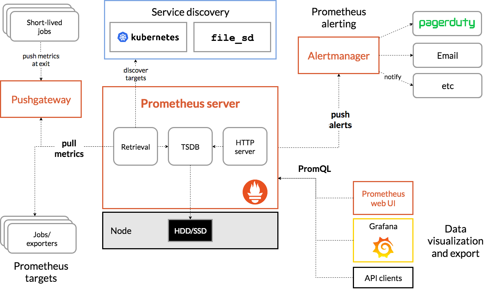

## prometheus

**prometheus架构图**



### 1.部署

#### 1.1.二级制部署

```bash
[root@node02 opt]# wget https://github.com/prometheus/prometheus/releases/download/v2.16.0-rc.1/prometheus-2.16.0-rc.1.linux-amd64.tar.gz
[root@node02 opt]# tar -xf prometheus-2.16.0-rc.0.linux-amd64.tar.gz
[root@node02 opt]# mv prometheus-2.16.0-rc.0.linux-amd64 prometheus
```

##### 1.1.1.prometheus常用参数

> prometheus命令

- --config.file=prometheus.yml #配置文件路径
- --web.listen-address="0.0.0.0:9090" #监听的地址
- --storage.tsdb.path="data/" #本地存储数据的目录
- --storage.tsdb.retention.tim #数据存储多长时间，如果需要长时间保留，可以使用其他时序数据库

> promtool命令

- check config prometheus.yml #检查prometheus配置文件的格式
- check rules rules #检查rule文件

##### 1.1.2.编写prometheus.service文件

> 编写下面prometheus.service文件后可以使用systemctl start prometheus启动服务以及systemctl reload prometheus热加载prometheus的配置文件。

```bash
[root@node01 prometheus]# cat /usr/lib/systemd/system/prometheus.service 
[Unit]
Description=prometheus


[Service]
Restart=on-failure
ExecStart=/opt/prometheus/prometheus --config.file=/opt/prometheus/prometheus.yml
ExecReload=/bin/kill -s HUP $MAINPID

[Install]
WantedBy=multi-user.target
[root@node01 prometheus]# 
```


#### 1.2.docker部署

> 首先配置docker的加速地址

```bash
[root@node02 opt] cat > /etc/docker/daemon.json <<EOF
{
        "registry-mirrors": ["https://zmoboljg.mirror.aliyuncs.com","https://registry.docker-cn.com"]
}                                                                        
EOF                                                                                    
[root@node02 opt] systemctl daemon-reload
[root@node02 opt] systemctl restart docker
[root@node02 opt] systemctl enable docker
```

> 如有需要，可以创建自定义的prometheus.yml文件和数据存储目录 https://prometheus.io/docs/prometheus/latest/installation/

```bash
# 官方镜像似乎不能把本地data目录挂载到镜像中，可以基于其他镜像写一个dockerfile
docker run -p 9090:9090 -v /tmp/prometheus.yml:/etc/prometheus/prometheus.yml  prom/prometheus
```


### 2.配置文件（prometheus.yml）

> https://prometheus.io/docs/prometheus/latest/configuration/configuration/ 后续把每个部分配置细致化

```bash
global: #总局配置
rule_files：#触发报警的规则
scrape_configs：#配置监控目标
alerting：#触发报警后由alertmanager组件接管
remote_write remote_read：#远程存储和读取
```

#### 2.1.案例:node_exporter

##### 2.1.1.node_exporter

> prometheus的架构中，prometheus不是直接去获取监控目标的监控数据，而是周期性的从一个http接口获取监控的数据，然后存储，接着提供一个UI通过promQL查询监控数据。通常一个exporter暴露一个http接口，exporter可以是:
>
> 1.独立于监控目标之外的程序
>
> 2.集成到监控目标的程序
>
> node_exporter是用来监控节点的基础信息：cpu、网络、磁盘等信息。通过/metrics（默认）接口暴露监控信息。https://github.com/prometheus/node_exporter/releases/download/v0.18.1/node_exporter-0.18.1.linux-amd64.tar.gz

```bash
[root@node01 opt]# cd node_exporter/
[root@node01 node_exporter]# ll
total 16500
-rw-r--r--. 1 3434 3434    11357 Jun  5  2019 LICENSE
-rwxr-xr-x. 1 3434 3434 16878582 Jun  5  2019 node_exporter
-rw-r--r--. 1 3434 3434      463 Jun  5  2019 NOTICE
[root@node01 node_exporter]# cat /usr/lib/systemd/system/node_exporter.service 
[Unit]
Description=node_exporter

[Service]
Restart=on-failure
ExecStart=/opt/node_exporter/node_exporter

[Install]
WantedBy=multi-user.target
[root@node01 node_exporter]# 
```

node_exporter的目录只提供了一个node_exporter的二进制文件，只需执行该程序即可。

- --web.listen-address=":9100" # 暴露的端口
- --web.telemetry-path="/metrics" #暴露的接口地址

查看暴露的监控信息


每一个监控指标类似于下面信息

> 第一行表示注释
>
> 第二行表示指标的类型，本次指标的类型为**gauge**
>
> 第三标表示指标的具体信息，指标名：go_goroutines，值为8

```bash
# HELP go_goroutines Number of goroutines that currently exist.
# TYPE go_goroutines gauge
go_goroutines 8
```

##### 2.2.2.和prometheus集成

```bash
[root@node01 prometheus]# vim prometheus.yml
scrape_configs:
  - job_name: 'prometheus'
    static_configs:
    - targets: ['localhost:9090']
  - job_name: 'node_exporter'
    static_configs:
    - targets: ['192.168.111.111:9100','192.168.111.112:9100']
```

由于修改了配置文件，需要重新加载，systemctl reload prometheus


使用promQL简单查询


### 3.promQL

#### 3.1.样本和数据类型

Prometheus会将所有采集到的样本数据以时间序列（time-series）的方式保存在内存数据库中，并且定时保存到硬盘上。time-series是按照时间戳和值的序列顺序存放的。简单来讲，样本由指标名，时间序列，指标的值组成。

```bash
<--------------- metric ---------------------><-timestamp -><-value->
http_request_total{status="200", method="GET"}@1434417560938 => 94355
http_request_total{status="200", method="GET"}@1434417561287 => 94334

http_request_total{status="404", method="GET"}@1434417560938 => 38473
http_request_total{status="404", method="GET"}@1434417561287 => 38544

http_request_total{status="200", method="POST"}@1434417560938 => 4748
http_request_total{status="200", method="POST"}@1434417561287 => 4785
```

数据类型分为4种：counter，Gauge，Histogram，Summary

counter：只加不减，比如请求次数

Gauge：可变化的值，可大可小，比如每天的访问量

Histogram和Summary（Summary理解不了...）：直方图，Histogram的直方图是计算每个区间的值。

#### 3.2.promQL查询

##### 3.2.1.基本查询

输入192.168.111.111:9090/graph，直接在输入框中输入指标名称

up等于up{}，{}中可以输入标签名来过滤，比如输入up{job="prometheus"}后只会显示up{instance="localhost:9090",job="prometheus"}


当输入up{job!="prometheus"}后会显示下面2个样本数据，查询也支持正则表达式，比如up{instance=~"192.*"}或者up{job!~"prometheus"}

##### 3.2.2.范围查询

可以返回一段时间内所有的样本数据，通过[]来表示

- s - 秒 [1s]
- m - 分钟 [1m]
- h - 小时 [1h]
- d - 天 [1d]
- w - 周 [1w]
- y - 年 [1y]

为什么会返回4条数据，是因为在prometheus.yml配置文件中global下的**evaluation_interval**配置为15s，表示每15s去获取监控的值。


这说明查询是瞬时的值，如果想要获取5分钟前的瞬时值，需要使用offset关键字，下图显示1分钟前的瞬时值


查询框还可以进行四则运算，返回的是**Scalar** 类型，也可以输入字符串，返回的是字符串

##### 3.2.3.函数使用

> 官方文档：https://prometheus.io/docs/prometheus/latest/querying/functions/ 

### 4.报警

##### 4.1.alertmanager简介

prometheus的报警分为两部分，一部分是在prometheus.yml中定义的报警规则，报警是由另一个组件Alertmanager实现，alertmanager可以与slack 微信等对接。alertmanager不支持和钉钉的对接，但是可以使用webhook和钉钉对接。


##### 4.2.alertmanager特性


- **分组**：分组机制可以将详细的告警信息合并成一个通知。在某些情况下，比如由于系统宕机导致大量的告警被同时触发，在这种情况下分组机制可以将这些被触发的告警合并为一个告警通知，避免一次性接受大量的告警通知，而无法对问题进行快速定位。
- **抑制**：抑制是指当某一告警发出后，可以停止重复发送由此告警引发的其它告警的机制。
- **静默**：静默提供了一个简单的机制可以快速根据标签对告警进行静默处理。如果接收到的告警符合静默的配置，Alertmanager则不会发送告警通知。静默设置需要在Alertmanager的Werb页面上进行设置。

##### 4.2.示例

首先需要编写报警的规则，需要在rule_files配置下配置rule的文件路径，可以写多个rule文件路径，也可以使用通配符

```bash
rule_files:
  - "/opt/prometheus/rules/*.yml"
```

创建hoststats.yml文件

```bash
groups:
- name: hostStatsAlert
  rules:
  - alert: hostCpuUsageAlert
    expr: 1 - sum(avg without (cpu)(irate(node_cpu_seconds_total{mode!='idle'}[5m]))) by (instance) > 0.85
    for: 1m
    labels:
      severity: page
    annotations:
      summary: "Instance {{ $labels.instance }} CPU usgae high"
      description: "{{ $labels.instance }} CPU usage above 85% (current value: {{ $value }})"
  - alert: hostMemUsageAlert
    expr: 1 - (node_memory_MemTotal_bytes - node_memory_MemAvailable_bytes)/node_memory_MemTotal_bytes > 0.85
    for: 1m
    labels:
      severity: page
    annotations:
      summary: "Instance {{ $labels.instance }} MEM usgae high"
      description: "{{ $labels.instance }} MEM usage above 85% (current value: {{ $value }})"
```

- name：报警的组名称
- alert：报警的名称
- expr：报警的promQL语句
- for：报警的情况持续时间，假如cpu使用率超过85%并且持续一分钟，那么才会报警
- labels：可以添加新的标签
- annotations：一些描述信息

{{ $labels.instance }}和{{ $value }}是golang的template使用方法，用来动态获取监控目标的值。

通过/alerts接口可以获取报警的信息


通过图片可以看出报警的3个阶段

- incative：没有触发报警
- Pending：触发了报警，但是还在等待for指定的时间内是否再次触发
- firing：for指定的时间内一直触发了报警

触发了报警后还需要指定alertmanager地址，需要将报警的信息发送到slack等报警源。

##### 4.3.alertmanager部署

> https://github.com/prometheus/alertmanager/releases/download/v0.20.0/alertmanager-0.20.0.linux-amd64.tar.gz

```bash
[root@node02 altermanager]# ll
total 48292
-rwxr-xr-x. 1 3434 3434 26971621 Dec 11 22:13 alertmanager
-rw-r--r--  1 3434 3434      433 Feb 14 18:33 alertmanager.yml
-rwxr-xr-x. 1 3434 3434 22458246 Dec 11 22:14 amtool
-rw-r--r--. 1 3434 3434    11357 Dec 11 22:51 LICENSE
-rw-r--r--. 1 3434 3434      457 Dec 11 22:51 NOTICE
[root@node02 altermanager]# ./alertmanager 启动服务
```

编写alertmanager服务的service文件

```bash
[root@node02 altermanager]# cat /usr/lib/systemd/system/alertmanager.service 
[Unit]
Description=alertmanager


[Service]
Restart=on-failure
ExecStart=/opt/altermanager/alertmanager --config.file=/opt/altermanager/alertmanager.yml
ExecReload=/bin/kill -s HUP $MAINPID

[Install]
WantedBy=multi-user.target
[root@node02 altermanager]# 
```

alertmanager.yml主要有这几个部分

- global：通用的配置，比如邮件，slack等
- templates：报警的模板
- route：报警的路由，不同的报警对应不同的路由
- receivers：接收器，不同的报警可以定义不同的接受器
- inhibit_rules：抑制规则

报警的流程：


当prometheus编写的警报生效后，可以为这些警告添加新的标签作为路由的根据。通常必须规定一个默认的总路由作为所有报警的路由，为了满足不同的路由对接不同的receiver，通常会编写不同的子路由。

示例:

当部署完alertmanager启动后，需要在prometheus配置中添加alertmanager地址

```bash
alerting:
  alertmanagers:
  - static_configs:
    - targets:
       - 192.168.111.112:9093
```

编写alertmanager的配置

> https://prometheus.io/docs/alerting/configuration/

```bash
[root@node02 altermanager]# cat alertmanager.yml 
global:
  resolve_timeout: 5m
  smtp_smarthost: 'smtp.qq.com:465'
  smtp_from: '1514102959@qq.com'
  smtp_auth_username: '1514102959@qq.com'
  smtp_auth_password: 'obdcvwnumowyijdf'
  smtp_require_tls: false
  smtp_hello: 'qq.com'

route:
  receiver: '163-receiver'
  routes:
  - repeat_interval: 2m
    group_by: ['severity']
    match: 
     severity: 'value1'
    receiver: '163-receiver'
  - repeat_interval: 2m
    group_by: ['severity']
    match: 
     severity: 'value2'
    receiver: 'qq-receiver'

receivers:
  - name: 163-receiver
    email_configs:
      - to: asd6335683@163.com
        send_resolved: true
  - name: qq-receiver
    email_configs:
      - to: 1514102959@qq.com
        send_resolved: true
[root@node02 altermanager]# 

```

首先查看receivers模块，下面定义了2个不同邮箱的receiver。再看route模块，route下的receiver就是默认的，下面routes下定义的就是子路由，group_by是使用标签进行分组，match匹配到标签的值，然后发送给下面的receiver。


##### 4.4.报警抑制

> https://prometheus.io/docs/alerting/configuration/#inhibit_rule

现在有个需求，当触发qq邮件报警时，不发送163邮件报警，那么需要编写抑制的规则

```bash
inhibit_rules:
- target_match:
    severity: 'value1'
  source_match:
    severity: 'value2'
  equal: ['instance']
```

target_match表示触发的报警中标签有包含**severity: 'value1'**的话，匹配source_match标签的报警将不会触发（需要看equal的值），这里target_match对应qq邮件报警，source_match表示163邮件报警，当然也可以使用正则表达式，不过要使用target_match_re和source_match_re。equal表示target_match目标和source_match目标如果是相同的标签值不会触发。重新加载alertmanager后，只有qq报警而不会有163报警。

还可以在alertmanager上临时抑制报警


创建silence规则后，下次报警将只会发送instance="192.168.111.1112:9100"节点的报警


##### 4.5.优化

> https://prometheus.io/docs/prometheus/latest/configuration/recording_rules/

记录规则允许您预先计算经常需要的表达式或计算开销较大的表达式，并将它们的结果保存为一组新的时间序列。在每次需要时，查询预先计算的结果通常比执行原始表达式快得多。这对于指示板尤其有用，因为每次刷新时都需要重复查询相同的表达式。通过record字段保存

```bash
groups:
  - name: example
    rules:
    - record: job:http_inprogress_requests:sum
      expr: sum(http_inprogress_requests) by (job)
```

### 5.服务发现

> https://prometheus.io/docs/prometheus/latest/configuration/configuration/#file_sd_config

当服务器的数量足够多的时候，不可能手动添加监控配置，这时需要服务发现机制，prometheus每隔一段时间就去读取服务发现的配置文件，获取监控目标。

```bash
scrape_configs:
- job_name: 'file_ds'
  file_sd_configs:
  - files:
    - prometheus-file-sd.yml
```

然后在同目录下编辑prometheus-file-sd.yml文件

```bash
[
  {
    "targets": [ "localhost:9090"],
    "labels": {
      "env": "localhost",
    }
  },
  {
    "targets": [ "localhost:9100" ],
    "labels": {
      "env": "prod",
    }
  },
  {
    "targets": [ "192.168.111.112:9100" ],
    "labels": {
      "env": "prod",
    }
  }
]
```

重新加载prometheus服务后，在浏览器中可以查看


##### 5.1.relabel机制

> https://prometheus.io/docs/prometheus/latest/configuration/configuration/#relabel_config

- __address__：当前Target实例的访问地址<host>:<port>
- __scheme__：采集目标服务访问地址的HTTP Scheme，HTTP或者HTTPS
- __metrics_path__：采集目标服务访问地址的访问路径
- __param_<name>：采集任务目标服务的中包含的请求参数

```bash
scrape_configs:
  - job_name: node_exporter
    consul_sd_configs:
      - server: localhost:8500
        services:
          - node_exporter
    relabel_configs:
    - source_labels:  ["__meta_consul_dc"]
      target_label: "dc"
      action: replace 
```

action的默认值是replace，首先会获取source_labels的值，然后使用target_label作为新的的标签名，source_labels作为值。

```bash
- job_name: 'kubernetes-nodes'
  kubernetes_sd_configs:
  - role: node
  relabel_configs:
  - action: labelmap
    regex: __meta_kubernetes_node_label_(.+)
```

labelmap表示使用匹配到node的标签作为标签名和值，也就是k8s node的label名和值

```bash
relabel_configs:
  - regex: label_should_drop_(.+)
    action: labeldrop
```

labeldrop和labelkeep表示丢掉或者只保留匹配到的标签

```bash
scrape_configs:
  - job_name: node_exporter
    consul_sd_configs:
      - server: localhost:8500
        services:
          - node_exporter
    relabel_configs:
    - source_labels:  ["__meta_consul_dc"]
      regex: "dc1"
      action: keep
```

keep和drop表示保留和丢掉监控的实例